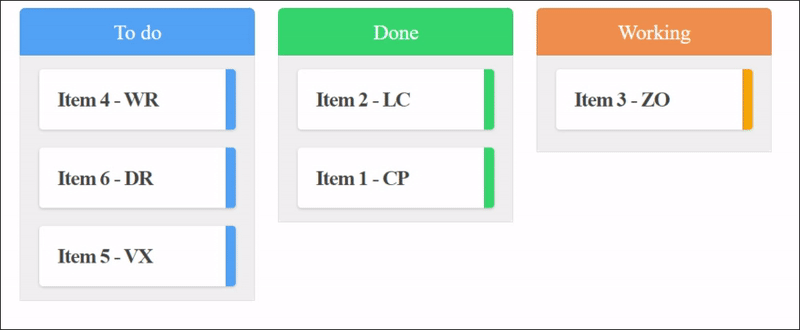

</img><a style="display: inline-block; border: 1px solid black;"></img></a>

# Muuri-react

  

Muuri-React is the React implementation of the amazing layout engine [Muuri](https://github.com/haltu/muuri). This library allows you to build all kinds of layouts and make them responsive, sortable, filterable, draggable and/or animated with [React](https://reactjs.org/). 

</img></img></img>

## Features 🌟

* Fully customizable layout 📏
* Drag & drop (even between grids) ✋
* Extremely performant 🚀
* Easy to use 👌
* Nested grids
* Fast animations 🏃
* Filtering ✔
* Sorting 🗃

## Documentation 📖
You can find the full documentation **[here](https://paol-imi.github.io/muuri-react)**.

## Examples 💡
* Grid **- [** ***[site](https://1czo5.csb.app/)*** **][** ***[codesandbox](https://codesandbox.io/s/muuri-react-grid-1czo5)*** **]**
* Kanban **- [** ***[site](https://zmypd.csb.app/)*** **][** ***[codesandbox](https://codesandbox.io/s/muuri-react-kanban-zmypd)*** **]**
* Resize **- [** ***[site](https://mz4di.csb.app/)*** **][** ***[codesandbox](https://codesandbox.io/s/muuri-react-userefresh-mz4di)*** **]**
* Drag **- [** ***[site](https://xlix7.csb.app/)*** **][** ***[codesandbox](https://codesandbox.io/s/muuri-react-usedrag-xlix7)*** **]**

## Credits 🤝

Thanks to **[Niklas Rämö](https://github.com/niklasramo)** for the amazing work with **[Muuri](https://github.com/haltu/muuri)**.

## License ©

Copyright © 2020 **[Paolo Longo](https://github.com/Paol-imi)** • **[MIT license](LICENSE)**.
